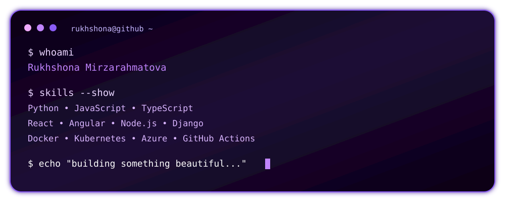
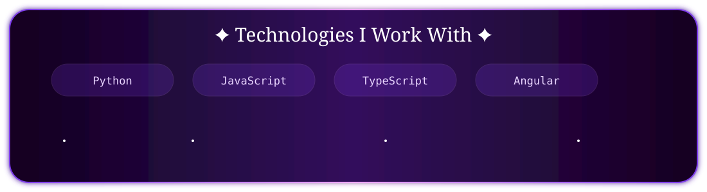

<!-- ====================================================== -->
<!--                    GALAXY HEADER                      -->
<!-- ====================================================== -->

  

  

 

<!-- ====================================================== -->
<!--                     ABOUT ME                           -->
<!-- ====================================================== -->

<h2 align="center">
  ✦ About Me ✦
</h2>

  

🔭 &nbsp; I'm currently working on **bots for a company**

🌱 &nbsp; I'm currently learning **#Python #JS #TS**

💻 &nbsp; I love turning ideas into **working software**

✨ &nbsp; Always learning, experimenting and building

 

<!-- ====================================================== -->
<!--                    TERMINAL                            -->
<!-- ====================================================== -->

  

 

<!-- ====================================================== -->
<!--                     STARS                              -->
<!-- ====================================================== -->

  

<!-- ====================================================== -->
<!--                   TECH STACK                           -->
<!-- ====================================================== -->

<h2 align="center">
  ✦ 🛠️ Tech Stack ✦
</h2>

  

  
  
  
  

   

  
  
  
  
  

   

  
  
  
  

   

  
  
  
  

   

  
  
  
  
  

   

  
  
  
  

  

<!-- ====================================================== -->
<!--                 CONNECT WITH ME                        -->
<!-- ====================================================== -->

<h2 align="center">
  ✦ 🔗 Connect With Me ✦
</h2>

 

<!-- ====================================================== -->
<!--                  GITHUB STATS                          -->
<!-- ====================================================== -->

<h2 align="center">
  ✦ 📊 GitHub Stats ✦
</h2>

 

<!-- ====================================================== -->
<!--              CONTRIBUTION GRAPH                        -->
<!-- ====================================================== -->

<h2 align="center">
  ✦ 📈 Contribution Graph ✦
</h2>

 

<!-- ====================================================== -->
<!--                    SNAKE                               -->
<!-- ====================================================== -->

<h2 align="center">
  ✦ 🐍 Contribution Snake ✦
</h2>

 

<!-- ====================================================== -->
<!--                     DEV QUOTE                           -->
<!-- ====================================================== -->

<h2 align="center">
  ✦ 💭 Dev Quote ✦
</h2>

 

<!-- ====================================================== -->
<!--                    FINAL STARS                          -->
<!-- ====================================================== -->

  

<!-- ====================================================== -->
<!--                    FOOTER                               -->
<!-- ====================================================== -->

  

  <i>
    ⭐ From
    <a href="https://github.com/mashinastaraya">
      mashinastaraya
    </a>
  </i>

